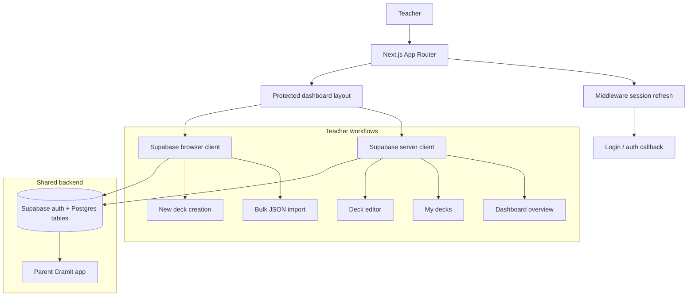

# Cramit Creator

Cramit Creator is the supporting web app for the Cramit product. It is a teacher-facing dashboard for creating, managing, and importing flashcard decks that power the main study experience in the parent app.

From a recruiter perspective, this repository shows a product-focused Next.js application with role-based access, Supabase-backed auth, deck management, bulk content import, and a clean server/client split for managing educational content.

## Recruiter snapshot

If you only scan a few things, this is the short version:

- a real supporting product, not a demo shell
- teacher-only dashboard with role-based access control
- Supabase auth and data access through server and browser clients
- deck creation, deck editing, and bulk JSON import flows
- a clean App Router structure with reusable UI components

## What the project does

Cramit Creator helps teachers and content owners:

- sign in and access a protected dashboard
- create new flashcard decks
- view a dashboard summary of deck and flashcard counts
- browse and edit existing decks
- import flashcards in bulk from JSON
- publish content that supports the parent Cramit study app

The goal is not to replace the student app. This repo exists to support the parent product by making content management fast, structured, and easy to maintain.

## How it fits the parent app

The parent Cramit app is the student-facing study experience. This project acts as the content operations layer behind it:

- teachers manage decks here
- the dashboard keeps content organized by subject and preparation category
- imported cards are prepared here before they are consumed in the study app
- Supabase provides the shared backend so both apps can work from the same data model

## What to notice in the code

- `src/app/dashboard/` contains the authenticated teacher dashboard and deck management flow
- `src/components/` holds reusable editor and import UI
- `src/utils/supabase-server.ts` and `src/utils/supabase-client.ts` separate server and browser access patterns
- `src/utils/supabase-middleware.ts` keeps auth sessions fresh and enforces role checks
- `src/app/auth/` handles sign-in callbacks and sign-out

This structure is useful for recruiters because it shows the app is deliberately layered instead of keeping business logic inside screen components.

## How it works

The important technical choice in this codebase is that the dashboard is server-rendered where possible, while Supabase handles authentication and persistence.



### Role-based access

The dashboard is protected behind a teacher role check. If a signed-in user does not have the correct role, they are redirected back to login. That keeps the content-management surface separate from the student-facing experience.

### Deck management

The dashboard shows deck counts, flashcard counts, and recent content. Teachers can browse all decks, open a deck editor, and maintain metadata such as subject, preparation category, and visibility.

### Bulk import

The import screen accepts a JSON array and maps cards into decks. This is the fastest path for loading large flashcard sets into the system.

### Shared auth and session handling

The app uses Supabase SSR helpers for both browser and server access. Middleware refreshes sessions so users stay signed in across requests, and server components can read the current user without duplicating auth logic.

## Main user flows

### 1. Authentication

Users sign in through Supabase-backed auth. The callback route restores the session and sends teachers into the dashboard.

### 2. Dashboard

The dashboard summarizes deck activity and gives a quick view of the content library.

### 3. My Decks

The decks page lists all available decks and links into the editor for each one.

### 4. Deck editor

The editor route loads a single deck and renders the flashcard editor for updating content.

### 5. Bulk import

The import page lets teachers upload or paste structured flashcard data so they can add many cards at once.

## Architecture highlights

The repository shows a clean separation between presentation and data access:

- Next.js App Router handles routing and server rendering
- Supabase handles auth, session state, and database access
- server utilities own authenticated reads on protected pages
- browser utilities power interactive editor and import actions
- shared UI components keep the dashboard consistent

## Tech stack

- Next.js 16
- React 19
- TypeScript
- Supabase SSR and Supabase JS
- Tailwind CSS 4
- shadcn-style UI components
- Lucide icons
- KaTeX and markdown rendering support

## Local development

### Requirements

- Node.js 18+ recommended
- npm
- A Supabase project configured for the Cramit backend

### Environment variables

Create a `.env.local` file with:

- `NEXT_PUBLIC_SUPABASE_URL`
- `NEXT_PUBLIC_SUPABASE_ANON_KEY`

### Install and run

```bash
npm install
npm run dev
```

Open [http://localhost:3000](http://localhost:3000) in your browser.

### Available scripts

| Script | Purpose |
| --- | --- |
| `npm run dev` | Start the Next.js development server |
| `npm run build` | Build the app for production |
| `npm run start` | Run the production build |
| `npm run lint` | Run ESLint |

## Repository layout

- `src/app/` App Router pages, layouts, and auth routes
- `src/components/` reusable dashboard and editor components
- `src/utils/` Supabase clients, middleware helpers, and shared utilities
- `public/` static assets

## Why this project is interesting

This repository demonstrates a supporting product that is still real software, not just an admin shell. It shows how to build a focused content-management app with authentication, role checks, server/client boundaries, and a workflow that directly feeds a parent learning product.

## Notes

The root homepage is still the default Next.js starter screen, while the real product surface lives under the authenticated dashboard. The main value of the repository is the teacher workflow behind the parent Cramit app.
